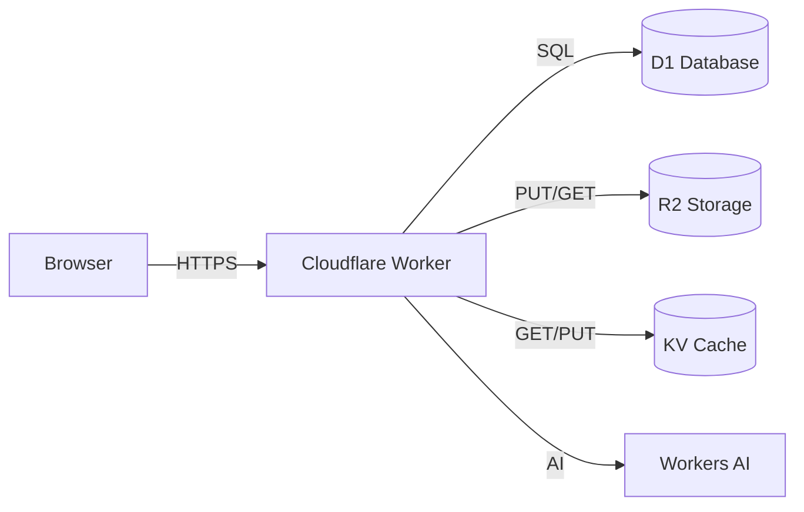

# Architecture & Best Practices for Beginners

This is how we structure fullstack apps so they stay maintainable, debuggable,
and don't turn into spaghetti as they grow.

---

## The Golden Rules

1. **No file longer than 300-400 lines.** Split it. Always.
2. **Domain-driven folders.** Each feature is a self-contained folder.
3. **No hardcoding.** Config goes in env vars, constants, or config files.
4. **Comment everything.** You're writing for a future you who forgot why.
5. **Log generously.** If something breaks, logs are your only friend.
6. **State management early.** Use Zustand before things get messy, not after.
7. **Security first.** Validate inputs, sanitize outputs, never trust the client.
8. **Document your architecture.** Create and maintain an `ARCHITECTURE.md` file.

---

## ARCHITECTURE.md (Mandatory)

Every project MUST have an `ARCHITECTURE.md` file at the root. This is a living document
that describes how the app is structured, what services it uses, and how data flows.
**Keep it up to date as the project evolves.** If the architecture changes and this file
doesn't, it becomes worse than having no docs at all.

### What Goes In It

```markdown
# Architecture

## Overview
One paragraph explaining what the app does and how it's deployed.

## System Diagram
[ASCII or Mermaid diagram showing services and data flow]

## Services Used
| Service | Purpose | Binding Name |
|---------|---------|-------------|
| Workers | API backend | - |
| D1 | User data, items | DB |
| R2 | File uploads | BUCKET |
| KV | Session cache | CACHE |

## Project Structure
[Folder tree showing where things live]

## Data Flow
1. User submits form → Frontend sends POST to /api/items
2. Worker validates input → Saves to D1 → Returns response
3. Frontend updates cache → Re-renders list

## Domain Map
| Domain | What It Handles | DB Tables |
|--------|----------------|-----------|
| users | Auth, profiles | users |
| items | CRUD for items | items |
| uploads | File management | uploads (metadata) |

## Environment Setup
| Environment | API URL | Database |
|-------------|---------|----------|
| Local dev | localhost:8787 | D1 local |
| Preview | preview.workers.dev | D1 preview |
| Production | api.myapp.com | D1 production |
```

### Example Diagram (Mermaid)

Include in ARCHITECTURE.md for visual clarity:



### When to Update ARCHITECTURE.md

- Added a new Cloudflare service or binding
- Created a new domain/feature folder
- Changed deployment strategy or data flow

**This file is the first thing any new developer (or AI agent) should read.**

---

## Recommended Fullstack Stack

Pick one column. Everything in a column works together out of the box.

| Layer | JS/TS Stack | Python Stack |
|-------|------------|-------------|
| **API framework** | Hono | FastAPI |
| **Database** | D1 + Drizzle ORM | D1 (raw SQL via bindings) |
| **Validation** | Zod (auto-generated from Drizzle) | Pydantic models |
| **Frontend** | React + Vite | React + Vite (same frontend) |
| **Routing** | TanStack Router (file-based) | TanStack Router |
| **Server state** | TanStack Query (React Query) | TanStack Query |
| **Client state** | Zustand | Zustand |
| **Auth** | Better Auth | Better Auth or custom JWT |
| **Storage** | R2 | R2 |
| **Styling** | Tailwind CSS | Tailwind CSS |
| **Deploy** | Wrangler CLI or GitHub Actions | pywrangler or GitHub Actions |

---

## Domain-Driven Folder Structure

Every feature is a **domain** - a folder with everything it needs. Don't scatter
related files across the codebase. If you delete the folder, the feature is gone.

```
src/
├── domains/
│   ├── users/                    # Each domain = self-contained feature
│   │   ├── users.schema.ts       # DB table + Zod validators + types
│   │   ├── users.routes.ts       # API endpoints (CRUD)
│   │   ├── users.api.ts          # React Query hooks (client)
│   │   ├── users.store.ts        # Zustand store (client UI state)
│   │   └── components/           # Feature-specific components
│   ├── items/                    # Same pattern per feature
│   └── uploads/                  # Same pattern (R2 endpoints here)
├── lib/                          # Shared utilities
│   ├── api.ts                    # API fetch helper
│   └── constants.ts              # App-wide constants
├── db/                           # Database setup (API only)
│   ├── index.ts                  # createDb factory
│   └── schema.ts                 # Barrel export of all domain schemas
└── app/                          # App shell (client only)
    ├── providers.tsx             # QueryClient, Auth, Theme wrappers
    └── main.tsx                  # Entry point
```

### Why This Works

- **Find anything in 5 seconds.** Need the user API? → `domains/users/users.routes.ts`
- **Add features without touching existing code.** New feature = new folder.
- **Delete features cleanly.** Remove the folder, remove the route mount. Done.
- **Each file has ONE job.** Schema, routes, hooks, store, components - all separate.

---

## File Size Rule: 300-400 Lines Max

If a file exceeds 400 lines, it's doing too much. Split it:

| Too big | Split into |
|---------|-----------|
| `users.routes.ts` (500 lines) | `users.routes.ts` (CRUD) + `users.admin.routes.ts` (admin-only) |
| `UserForm.tsx` (400 lines) | `UserForm.tsx` + `UserFormFields.tsx` + `useUserForm.ts` (hook) |
| `users.schema.ts` (350 lines) | `users.schema.ts` (table) + `users.validators.ts` (complex Zod rules) |
| Giant component with logic | Extract logic into custom hook (`useXxx.ts`) |

---

## No Hardcoding - Ever

```typescript
// BAD - hardcoded values scattered in code
const API_URL = 'https://my-api.workers.dev'
const MAX_UPLOAD_SIZE = 5242880
const ALLOWED_ROLES = ['admin', 'editor']

// GOOD - centralized constants
// lib/constants.ts
export const CONFIG = {
  API_URL: import.meta.env.VITE_API_URL || '/api',
  MAX_UPLOAD_SIZE: 5 * 1024 * 1024,  // 5MB
  ALLOWED_ROLES: ['admin', 'editor'] as const,
  PAGINATION: { DEFAULT_PAGE_SIZE: 20, MAX_PAGE_SIZE: 100 },
} as const

// GOOD - environment-dependent config
// wrangler.toml [vars]
// ENVIRONMENT = "production"
// Then in code: c.env.ENVIRONMENT
```

**Rule:** If a value might change, or appears more than once, it goes in constants or env vars.

---

## State Management: When to Use What

### Server State (data from your API) → TanStack Query

TanStack Query handles: fetching, caching, refetching, loading states, error states.
You should NOT put API data in Zustand.

```typescript
// This is all you need for server state:
const { data, isLoading, error } = useItems()   // React Query hook
```

### Client/UI State (local to the browser) → Zustand

Use Zustand for: selected items, filters, sidebar open/closed, form drafts,
UI toggles, anything that's NOT from the server.

```typescript
// domains/items/items.store.ts
import { create } from 'zustand'

/**
 * UI state for the items feature.
 * Tracks what's selected, what filters are active, etc.
 * Server data (actual items) lives in React Query, not here.
 */
interface ItemsStore {
  // What item is currently selected in the list
  selectedId: string | null
  setSelected: (id: string | null) => void

  // Active filter for the list view
  filterStatus: 'all' | 'active' | 'archived'
  setFilter: (status: 'all' | 'active' | 'archived') => void

  // Sidebar visibility
  detailPanelOpen: boolean
  toggleDetailPanel: () => void
}

export const useItemsStore = create<ItemsStore>((set) => ({
  selectedId: null,
  setSelected: (id) => set({ selectedId: id }),

  filterStatus: 'all',
  setFilter: (filterStatus) => set({ filterStatus }),

  detailPanelOpen: false,
  toggleDetailPanel: () => set((s) => ({ detailPanelOpen: !s.detailPanelOpen })),
}))
```

### When to Introduce Zustand

- You're passing props through 3+ levels ("prop drilling") → use Zustand
- Multiple components need the same UI state → use Zustand
- You have complex form state with many fields → use Zustand
- You catch yourself using `useState` for something 3+ components share → Zustand

### Decision Flowchart

```
Is the data from your API?
  YES → TanStack Query (useQuery/useMutation)
  NO → Is it shared between components?
    YES → Zustand store
    NO → Local useState is fine
```

---

## Security Basics

### Input Validation (ALWAYS)

```typescript
// API side: validate EVERY input with Zod
app.post('/items',
  zValidator('json', insertItemSchema),  // Rejects invalid data before your code runs
  async (c) => {
    const data = c.req.valid('json')     // Guaranteed to match schema
    // ...
  }
)
```

### Never Trust the Client

```typescript
// BAD - trusting client-sent user ID
app.post('/items', async (c) => {
  const { userId, title } = await c.req.json()  // Client could send any userId!
  await db.insert(items).values({ userId, title })
})

// GOOD - get user ID from auth token (server-verified)
app.post('/items', authMiddleware, async (c) => {
  const userId = c.get('userId')  // From verified JWT/session
  const { title } = c.req.valid('json')
  await db.insert(items).values({ userId, title })
})
```

### SQL Injection Protection

```typescript
// BAD - string concatenation (SQL injection!)
await db.prepare(`SELECT * FROM users WHERE id = ${userId}`).run()

// GOOD - parameterized queries (Drizzle does this automatically)
await db.select().from(users).where(eq(users.id, userId))

// GOOD - parameterized raw SQL
await db.prepare("SELECT * FROM users WHERE id = ?").bind(userId).run()
```

### Other Security Musts

- Store secrets via `wrangler secret put`, never in code or git
- Use HTTPS only (Cloudflare does this automatically)
- Set CORS properly (don't use `*` in production)
- Rate limit your endpoints (use KV counters or Turnstile)
- Sanitize user-generated HTML before rendering (prevent XSS)

---

## Comment Style for Beginners

Write comments that explain **why**, not just what. Assume the reader is new.

```typescript
// BAD - just restates the code
// Get all items
const items = await db.select().from(itemsTable).all()

// GOOD - explains WHY and gives context
// Fetch all items from D1. Drizzle ORM generates type-safe SQL.
// .all() executes the query and returns an array.
const items = await db.select().from(itemsTable).all()

// GOOD - explain the non-obvious
// Factory function because D1 binding (env.DB) is only available
// inside request handlers, not at module level — create fresh per request.
export const createDb = (d1: D1Database) => drizzle(d1, { schema })

// GOOD - explain security logic
// Verify user owns this item before deleting (prevents other users deleting your data)
const item = await db.select().from(items).where(eq(items.id, itemId)).get()
if (!item || item.userId !== userId) return c.json({ error: 'Not found' }, 404)
```

---

## API Response Pattern

Every API response uses the same shape. Clients always know what to expect.

```typescript
// Success
{ "data": { "id": 1, "name": "Alice" } }
{ "data": [{ "id": 1 }, { "id": 2 }] }

// Error
{ "error": "Item not found" }
{ "error": "Validation failed: title is required" }
```

```typescript
// Type definition
type ApiResponse<T> = { data: T }
type ApiError = { error: string }
```

---

## Extensibility Patterns

### Adding a New Feature (5 Steps)

```bash
# 1. Create domain folder
mkdir -p src/domains/orders

# 2. Define schema (API)
# src/domains/orders/orders.schema.ts → table + Zod + types

# 3. Create routes (API)
# src/domains/orders/orders.routes.ts → CRUD endpoints

# 4. Mount router (API) - one line in index.ts
app.route('/orders', ordersRouter)

# 5. Create client hooks + components
# src/domains/orders/orders.api.ts → React Query hooks
# src/domains/orders/components/ → UI
```

No other files need to change. The schema auto-discovery (`**/*.schema.ts`) picks up new schemas.
TanStack Router auto-discovers new route files. The system is designed to grow without refactoring.

### Config Over Code

```typescript
// BAD - behavior buried in code
if (userRole === 'admin' || userRole === 'editor') { /* can edit */ }

// GOOD - configurable permissions
const PERMISSIONS = {
  'items:edit': ['admin', 'editor'],
  'items:delete': ['admin'],
  'items:view': ['admin', 'editor', 'viewer'],
} as const
```
