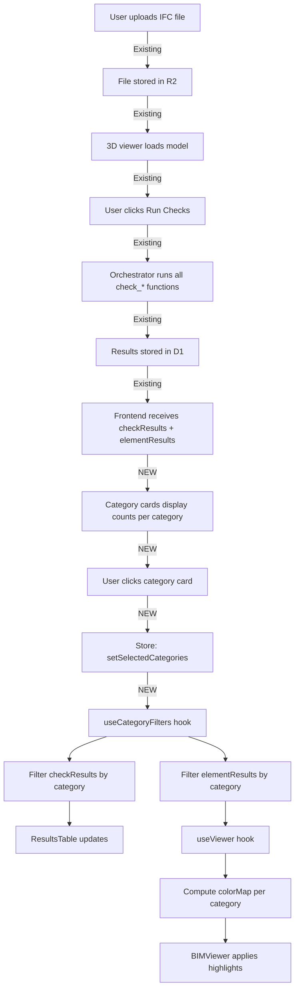

# PRD: Category-Based Compliance Visualization in 3D Viewer

**Team:** Team-D  
**Status:** Draft  
**Created:** February 19, 2026  
**Last Updated:** February 19, 2026  
**Priority:** High  
**Estimated Effort:** 3-5 days  

> **Product Context:** The IFC Compliance Checker is a building compliance tool that allows architects, engineers, and designers to automatically validate a 3D building model against key regulatory standards. Users upload an IFC file and the system analyzes the model across five compliance categories — Fire Safety, Habitability, Energy Consumption, Structure, and Lighting Facade — returning a pass or fail result with highlighted elements in a 3D visualization. This PRD defines enhancements to enable category-based filtering and multi-check overlay.

---

## 1. Executive Summary

The IFC Compliance Checker is a building compliance tool that allows architects, engineers, and designers to automatically validate a 3D building model against key regulatory standards. This PRD outlines enhancements to the platform's 3D viewer to enable **category-based compliance visualization** across five compliance categories: Fire Safety, Habitability, Energy Consumption, Structure, and Lighting Facade.

Users upload an IFC file, the system analyzes the model, and returns pass/fail results with highlighted elements showing exactly where the model does not meet requirements in a 3D visualization. This feature adds the ability to **filter by category**, **overlay multiple checks**, and identify elements that fail multiple requirements simultaneously.

**Value Proposition:**  
- **Spatial Understanding:** See exactly where compliance issues exist in 3D context  
- **Multi-Constraint Analysis:** Overlay different checks to find elements violating multiple rules  
- **Faster Iteration:** Visual feedback reduces time to understand and fix compliance issues  
- **Focused Reviews:** Filter by category to address Fire Safety, then Habitability, systematically  

---

## 2. Problem Statement

**Current State:**  
- The platform runs compliance checks and returns pass/fail results in a flat table  
- The 3D viewer exists but only highlights elements based on pass/fail (red/gray)  
- Users cannot filter by compliance category  
- Users cannot overlay multiple checks to see compounding issues  
- No visual way to compare different compliance requirements  

**Pain Points:**  
1. **Cognitive Overload:** Looking at a table with 50+ failed elements doesn't show where problems are clustered  
2. **No Multi-Constraint View:** Can't see rooms that fail both airflow AND occupancy limits  
3. **Category Blindness:** Fire safety issues mixed with energy issues in one undifferentiated list  
4. **Sequential Workflow Breaks:** Architects want to fix Fire Safety first, then Habitability, but can't filter the view  

**User Story:**  
> "As an architect, I want to **select Fire Safety checks** and see all non-compliant elements highlighted in red in the 3D model, so I can **quickly locate and fix fire code violations** without sorting through unrelated habitability or energy issues. Then I want to overlay Habitability checks to see if any rooms fail both requirements."

---

## 3. Goals & Success Metrics

### Goals
1. Enable architects, engineers, and designers to **filter compliance results by category** (Fire Safety, Habitability, etc.)  
2. Visualize non-compliant elements in the **3D viewer with category-specific color-coded highlighting**  
3. Support **multi-check overlay** (e.g., show Fire Safety + Habitability simultaneously to identify compounding issues)  
4. Provide an **intuitive UI for selecting/deselecting categories and checks** without requiring training  
5. Maintain system performance with large models (500+ elements)  

### Success Metrics
- **User Engagement:** 70%+ of users who run checks also interact with the 3D viewer category filters  
- **Time to Resolution:** 30% reduction in time from check completion to issue identification (measured via user testing)  
- **Feature Adoption:** 80%+ of projects with failures use category filtering within first 2 weeks of launch  
- **Multi-Category Usage:** 40%+ of sessions use 2+ category overlays to identify compounding issues  

### Non-Goals (Out of Scope)
- Editing IFC models in the viewer  
- Real-time rule configuration  
- Mobile/tablet optimization (desktop-first)  
- AI-suggested fixes  

---

## 4. User Experience Flow

### 4.1 Core Flow: Upload → Analyze → Visualize by Category

```
1. User uploads IFC file → file loads in 3D viewer (existing functionality)
2. User clicks "Run Checks" → system analyzes across all 5 categories (existing functionality)
3. System returns pass/fail results → 3D viewer shows all failures in default view
4. User sees **category cards** (NEW) displaying:
   - 🔥 Fire Safety: 12/14 ✓ (85%)
   - 🏠 Habitability: 8/10 ✗ (80%)
   - ⚡ Energy: 15/15 ✓ (100%)
   - 🏗️ Structure: 10/12 ✗ (83%)
   - 💡 Lighting Facade: 5/5 ✓ (100%)
5. User clicks on **"Fire Safety" card** → card becomes active (blue border)
   - 3D viewer highlights ONLY Fire Safety failures in RED
   - Results table filters to show only Fire Safety checks
   - Other elements fade to light gray or hidden (user preference)
6. User clicks on **"Habitability" card** (multi-select mode)
   - 3D viewer now shows:
     * 🔴 Red: Fire Safety failures only
     * 🟠 Orange: Habitability failures only
     * 🟣 Purple/Dark Red: Elements failing BOTH (blended color)
   - Results table shows both Fire Safety + Habitability checks
   - Legend updates to show color mapping
7. User clicks a specific check row (e.g., "check_fire_rating")
   - 3D viewer isolates ONLY that check's failed elements at full opacity
   - All other elements fade to 10% opacity (context preserved)
   - Camera can optionally focus on isolated elements
8. User clicks check row again → returns to category view
9. User clicks category card again → deselects that category
10. When all categories deselected → returns to default "show all failures" view
```

### 4.2 Interaction States

| State | Visual Feedback | Behavior |
|-------|----------------|----------|
| No checks run | Category cards disabled, 3D viewer shows default model | N/A |
| Checks complete | Category cards show counts, default view shows all failures | Click to filter |
| 1 category selected | Card has blue border, 3D viewer shows single color | Click again to deselect |
| 2+ categories selected | Cards have blue borders, 3D viewer shows blended colors | Click to toggle |
| Specific check selected | Check row highlighted, viewer isolates that check | Click row again to deselect |

### 4.3 Mockup (Conceptual)

```
┌────────────────────────────────────────────────────────────────────┐
│  IFC Compliance Checker                                            │
│  Project: Building A    [Upload IFC] [Run Checks]                 │
├────────────────────────────────────────────────────────────────────┤
│                                                                     │
│  ┌─── Compliance Categories ──────────────────────────────────┐   │
│  │ [🔥 Fire Safety]  [🏠 Habitability]  [⚡ Energy]           │   │
│  │   12 / 14 ✓        8 / 10 ✗          15 / 15 ✓            │   │
│  │                                                             │   │
│  │ [🏗️ Structure]    [💡 Lighting Facade]                     │   │
│  │   10 / 12 ✗        5 / 5 ✓                                 │   │
│  └─────────────────────────────────────────────────────────────┘  │
│                                                                     │
│  ┌─────────── 3D Viewer ─────────┐  ┌─── Results Table ────────┐ │
│  │                                │  │ Check           Status   │ │
│  │     [3D MODEL WITH             │  │ 🔥 fire_rating    FAIL   │ │
│  │      RED HIGHLIGHTED           │  │ 🔥 door_width     PASS   │ │
│  │      ELEMENTS]                 │  │ 🏗️ beam_capacity  FAIL   │ │
│  │                                │  │ ...                      │ │
│  │   Legend: 🔴 Fail  ⚪ Pass     │  └──────────────────────────┘ │
│  └────────────────────────────────┘                               │
└────────────────────────────────────────────────────────────────────┘
```

---

## 5. Functional Requirements

### 5.1 Category Cards (New Component)
- **FR-1.1:** Display 5 category cards: Fire Safety, Habitability, Energy Consumption, Structure, Lighting Facade  
- **FR-1.2:** Each card shows: category name, pass count / total count, % compliance, status icon  
- **FR-1.3:** Cards are **clickable** to toggle category visibility  
- **FR-1.4:** Multiple cards can be selected simultaneously (multi-select via click)  
- **FR-1.5:** Visual state: default (gray border) → active (blue border + subtle background)  
- **FR-1.6:** Disabled state when no checks have been run (grayed out, not clickable)  

### 5.2 Check-to-Category Mapping (Data Layer)
- **FR-2.1:** Backend `/health` endpoint returns check functions with `category` field  
- **FR-2.2:** Team-D checks map to categories:
  - `check_fire_rating` → Fire Safety  
  - `check_special_risk_rooms` → Fire Safety  
  - *(To be defined by Team-D for other checks)*  
- **FR-2.3:** Checks without category default to "Uncategorized"  

### 5.3 3D Viewer Highlighting
- **FR-3.1:** When 1 category selected: highlight failed elements in **category color** (default: red)  
- **FR-3.2:** When 2+ categories selected: use **color blending**:
  - Fire Safety: `#e62020` (red)  
  - Habitability: `#ff9500` (orange)  
  - Energy: `#34c759` (green)  
  - Structure: `#007aff` (blue)  
  - Lighting: `#af52de` (purple)  
  - Overlapping failures: blend colors (e.g., red + orange = darker red-orange)  
- **FR-3.3:** Pass elements: `#d0d3da` (light gray) or hidden based on user preference  
- **FR-3.4:** Clicking a specific check row in the table **isolates** that check's elements (others fade to 10% opacity)  

### 5.4 Results Table Filtering
- **FR-4.1:** Table filters to show only checks from selected categories  
- **FR-4.2:** When no categories selected, show all checks  
- **FR-4.3:** Clicking a check row highlights its elements in the 3D viewer  

### 5.5 State Persistence
- **FR-5.1:** Selected categories persist during session (stored in Zustand)  
- **FR-5.2:** Deselecting all categories resets to "show all failures" state  

---

## 6. Technical Design

### 6.1 Architecture

**New Components:**
```
frontend/src/features/checks/
├── CategoryCards.tsx          ← New: Category selection UI
├── CategoryFilterPanel.tsx    ← New: Container with cards + legend
└── useCategoryFilters.ts      ← New: Hook for category/check filtering logic

frontend/src/stores/slices/
└── checksSlice.ts             ← Extend: add selectedCategories, selectedChecks
```

**Modified Components:**
```
frontend/src/features/viewer/
├── useViewer.ts               ← Update: color logic based on categories
└── BIMViewer.tsx              ← Update: handle multi-color highlighting

frontend/src/features/checks/
└── ResultsTable.tsx           ← Update: filter by selectedCategories

backend/
└── orchestrator.py            ← Update: return category metadata in /health
```

### 6.2 Data Flow

**Complete IFC Compliance Checker Workflow (with new category filtering):**



**Key Principle:** Category filtering is a **frontend-only feature**. The backend continues to run all checks and return all results. The frontend decides what to display based on user selection.

### 6.3 State Schema

**Extend `ChecksSlice`:**
```typescript
export type ChecksSlice = {
  checkResults: CheckResult[];
  elementResults: ElementResult[];
  setCheckResults: (results: CheckResult[]) => void;
  setElementResults: (results: ElementResult[]) => void;
  
  // NEW:
  selectedCategories: Set<string>; // e.g., Set(["Fire Safety", "Habitability"])
  toggleCategory: (category: string) => void;
  clearCategories: () => void;
  
  selectedCheckId: string | null; // For row-click isolation
  setSelectedCheckId: (id: string | null) => void;
};
```

**Extend `CheckResult` type:**
```typescript
export type CheckResult = {
  id: string;
  check_name: string;
  team: string;
  status: "pass" | "fail" | "running" | "error";
  summary: string;
  category?: string; // NEW: "Fire Safety" | "Habitability" | etc.
  // ... existing fields
};
```

### 6.4 Backend Changes

**`orchestrator.py` (minimal change):**
```python
# Add category metadata to check discovery
# Team-D focus: Fire Safety & Structure categories for v1
CATEGORY_MAP = {
    # Fire Safety
    "check_fire_rating": "Fire Safety",
    "check_special_risk_rooms": "Fire Safety",
    "check_special_risk_boundary_doors": "Fire Safety",
    "check_sector_size_compliance": "Fire Safety",
    "check_si4_administrativo": "Fire Safety",
    "check_si6_compliance": "Fire Safety",
    
    # Structure (overlaps with Fire Safety for structural elements)
    # ... Future: Habitability, Energy, Lighting Facade
}

def discover_checks():
    checks = []
    for team, func_name, func in _scan_checker_files():
        checks.append({
            "team": team,
            "name": func_name,
            "category": CATEGORY_MAP.get(func_name, "Uncategorized"),
        })
    return checks
```

**Backend returns category in `/health`:**
```json
{
  "status": "ok",
  "checks": [
    {
      "team": "team-d",
      "name": "check_fire_rating",
      "category": "Fire Safety"
    }
  ]
}
```

### 6.5 Color Blending Algorithm

```typescript
function blendColors(colors: string[]): string {
  if (colors.length === 0) return "#d0d3da"; // default gray
  if (colors.length === 1) return colors[0];
  
  // Average RGB values
  const rgb = colors.map(hex => {
    const r = parseInt(hex.slice(1, 3), 16);
    const g = parseInt(hex.slice(3, 5), 16);
    const b = parseInt(hex.slice(5, 7), 16);
    return { r, g, b };
  });
  
  const avg = rgb.reduce(
    (acc, c) => ({ r: acc.r + c.r, g: acc.g + c.g, b: acc.b + c.b }),
    { r: 0, g: 0, b: 0 }
  );
  
  const n = rgb.length;
  const r = Math.round(avg.r / n);
  const g = Math.round(avg.g / n);
  const b = Math.round(avg.b / n);
  
  return `#${r.toString(16).padStart(2, '0')}${g.toString(16).padStart(2, '0')}${b.toString(16).padStart(2, '0')}`;
}
```

---

## 7. Implementation Plan

### Phase 1: Category Data Layer (1 day)
- [ ] Extend `CheckResult` type with `category` field  
- [ ] Add `CATEGORY_MAP` to `orchestrator.py`  
- [ ] Update `/health` endpoint to return category metadata  
- [ ] Team-D maps all their checks to categories  

### Phase 2: Store & Hooks (1 day)
- [ ] Extend `checksSlice.ts` with `selectedCategories`, `selectedCheckId`  
- [ ] Create `useCategoryFilters.ts` hook  
- [ ] Update `useViewer.ts` to support multi-category color mapping  

### Phase 3: UI Components (2 days)
- [ ] Create `CategoryCards.tsx` component  
- [ ] Create `CategoryFilterPanel.tsx` container  
- [ ] Update `ResultsTable.tsx` to filter by selected categories  
- [ ] Add check row click → isolate in viewer  

### Phase 4: 3D Viewer Integration (1 day)
- [ ] Implement color blending in `useViewer.ts`  
- [ ] Test multi-category highlighting  
- [ ] Add element isolation (fade non-selected to 10% opacity)  

### Phase 5: Polish & Testing (1 day)
- [ ] Visual design polish (card styles, colors, transitions)  
- [ ] Edge case testing (no checks, all pass, single category, 5 categories)  
- [ ] Performance testing (1000+ elements)  
- [ ] Documentation update  

**Total Estimated Effort:** 3-5 days (1 developer)

---

## 8. Feasibility Analysis

> **Note:** This PRD aligns with the updated IFC Compliance Checker product overview. The platform already supports upload, analysis, and 3D visualization. This feature adds **category-based filtering** and **multi-check overlay** capabilities to the existing workflow.

### 8.1 Existing Infrastructure ✅

| Feature | Status | Details |
|---------|--------|---------|
| 3D Viewer | ✅ **Exists** | ThatOpen Components (OBC) fully integrated |
| Element Highlighting | ✅ **Exists** | `colorMap` in viewerSlice, highlight by GUID |
| Hide/Show/Isolate | ✅ **Exists** | `hideElements`, `showElements`, `isolateGuids` |
| Check Results Store | ✅ **Exists** | `checkResults`, `elementResults` in Zustand |
| Results Table | ✅ **Exists** | Expandable rows, status badges |
| Viewer ↔ Checks Integration | ✅ **Exists** | `useViewer` hook syncs results → colorMap |

**Assessment:** The platform already has **80% of the required infrastructure**. This feature is primarily a **UI/UX layer** on top of existing capabilities.

### 8.2 What Needs to Be Built 🔨

| Component | Complexity | Estimated Time |
|-----------|-----------|----------------|
| Category cards UI | Low | 4-6 hours |
| Category filtering logic | Low | 3-4 hours |
| Multi-category color blending | Medium | 4-6 hours |
| Check isolation in viewer | Low | 2-3 hours |
| Backend category mapping | Low | 1-2 hours |
| Testing + polish | Medium | 8 hours |

**Total New Code:** ~400-500 lines  
**Total Effort:** 3-5 days (1 developer)  

### 8.3 Technical Risks & Mitigations

| Risk | Likelihood | Impact | Mitigation |
|------|-----------|--------|------------|
| Color blending looks unclear | Medium | Medium | User testing with 3-5 designers; add optional "show one category at a time" mode |
| Performance with 5 categories × 200 elements | Low | Medium | Debounce color map recalculation; memoize filtered results |
| Team-D checks don't map cleanly to 5 categories | High | Low | Allow "Uncategorized" fallback; refine mapping during Phase 1 |
| Multi-select UX confusing | Low | High | Add clear visual feedback (card borders, legend, "Clear All" button) |

### 8.4 Dependencies

| Dependency | Owner | Status | Blocker? |
|-----------|-------|--------|----------|
| Team-D check functions follow contract | Team-D | ⚠️ **Partial** (1/8 compliant) | **YES** — must fix before Phase 1 |
| Backend `/health` endpoint | Platform | ✅ Exists | No |
| 3D viewer loads IFC files | Platform | ✅ Works | No |
| Check results in D1 database | Platform | ✅ Works | No |

**Critical Blocker:** Team-D must complete their check function refactoring (see separate compliance report) to ensure all checks are discoverable by the orchestrator.

### 8.5 Cross-Team Coordination

| Team | Involvement | Action Required |
|------|------------|-----------------|
| **Team-D** | Owners | Map all check functions to categories, test against live IFC files |
| **Platform (Captains)** | Support | Review backend changes, deploy updated orchestrator |
| **Other Teams** | Optional | Can adopt same category system for their checks |

---

## 9. Open Questions

1. **Category Naming:** Should we use "Fire Safety" or "Fire Compliance"? → **Decision:** "Fire Safety" (confirmed with overview)  
2. **Color Palette:** Are the proposed colors accessible (colorblind-friendly)? → **Action:** Run through WCAG contrast checker before Phase 3  
3. **Default State:** When checks complete, should all categories be selected or none? → **Proposal:** None selected, show all in default gray. User must opt-in to category filtering.  
4. **Mobile:** Do we need mobile/tablet support in v1? → **Decision:** No, desktop-first (architects work on workstations)  
5. **Icon System:** Should each category have an icon (🔥 Fire, 🏠 Habitability)? → **Proposal:** Yes, improves scannability. Team-D to select icons in Phase 3.  

---

## 10. Success Criteria & Launch Checklist

**Must-Have for Launch:**
- [ ] All 5 categories display with correct pass/fail counts  
- [ ] Single-category selection highlights elements in 3D viewer  
- [ ] Multi-category selection shows blended colors  
- [ ] Results table filters by selected categories  
- [ ] Clicking a check row isolates its elements in viewer  
- [ ] Performance: <2s to update highlights for 500 elements  
- [ ] No regressions in existing check runner or viewer  

**Nice-to-Have (Post-Launch):**
- [ ] Export highlighted elements to CSV  
- [ ] "Show only failures" toggle per category  
- [ ] Category comparison mode (side-by-side 3D views)  
- [ ] Save/load category filter presets  

**Launch Gate:** Platform team approval + 3 successful tests on real projects.

---

## 11. Appendix

### A. Proposed Category Definitions

| Category | Description | Example Checks | Team-D Priority |
|----------|-------------|----------------|----------------|
| **Fire Safety** | Structural fire resistance, fire doors, sprinklers, evacuation routes, fire sectors | `check_fire_rating`, `check_special_risk_rooms`, `check_sector_size_compliance`, `check_si4_administrativo`, `check_si6_compliance` | ✅ Active |
| **Habitability** | Room dimensions, ventilation, occupancy limits, accessibility, interior conditions | `check_room_area`, `check_ceiling_height`, `check_door_width`, `check_ventilation` | ⏳ Planned |
| **Energy Consumption** | Insulation, thermal performance, HVAC efficiency, renewable energy | `check_insulation_r_value`, `check_solar_production`, `check_thermal_transmittance` | ⏳ Planned |
| **Structure** | Load-bearing capacity, seismic compliance, foundation, structural fire resistance | `check_column_capacity`, `check_beam_deflection`, `check_fire_rating` (structural elements) | ✅ Active |
| **Lighting Facade** | Natural light, window-to-floor ratio, facade requirements, daylight factors | `check_window_area`, `check_daylight_factor`, `check_facade_compliance` | ⏳ Planned |

### B. Technology Stack

- **Frontend:** React 18, TanStack Router, Zustand, TypeScript  
- **3D Engine:** ThatOpen Components (OBC) + Three.js  
- **Backend:** FastAPI, Python 3.10+  
- **IFC Processing:** ifcopenshell, web-ifc WASM  
- **Storage:** Cloudflare R2, D1 (SQLite)  

### C. Related Documents

- [IFCore Platform AGENTS.md](../AGENTS.md) — Check function contracts  
- [Team-D Compliance Report](../backend/teams/team-d/README.md) — Current check status  
- [Frontend Architecture](/.copilot/skills/IFCore-skill/references/frontend-architecture.md) — Store patterns  

---

**Document Version:** 1.1  
**Changelog:**  
- v1.0 (Feb 19): Initial PRD draft  
- v1.1 (Feb 19): Updated to align with revised IFC Compliance Checker product overview; expanded user base to include architects, engineers, and designers; refined category definitions and mockup  

**Next Review:** After Phase 1 completion  
**Owner:** Team-D Lead + Platform Captains
